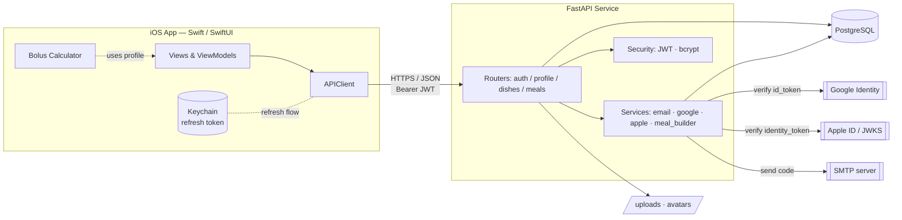

<p align="center">
  
</p>

# Medoed

**A diabetes companion for iOS — carb counting, insulin bolus estimation, a shared dish library, and a meal diary, backed by a secure FastAPI service.**

[](https://swift.org)
[](https://developer.apple.com/xcode/swiftui/)
[](https://www.apple.com/ios/)
[](https://www.python.org)
[](https://fastapi.tiangolo.com)
[](https://www.sqlalchemy.org)
[](https://www.postgresql.org)
[](https://jwt.io)
[](LICENSE)

> ⚠️ **Medical disclaimer.** Medoed is an informational aid for people managing diabetes. Every dose it suggests is an estimate derived from user-supplied parameters and must be confirmed with a physician. It is not a medical device.

---

## 📋 Overview

**Medoed** (internal codename *DiabetAI*) is a full-stack diabetes management app. It helps people who count carbohydrates estimate a mealtime insulin bolus, keep a personal and shared library of dishes with per-ingredient nutrition data, and log what they eat over time.

The iOS client is written entirely in **Swift / SwiftUI** and supports three sign-in methods (email + one-time code, Google, and Apple). The backend is a **FastAPI** service backed by **PostgreSQL** via SQLAlchemy, issuing short-lived JWT access tokens paired with rotating opaque refresh tokens. The insulin math runs on the client using the endocrinology parameters stored in each user's profile (target glucose, insulin sensitivity factor, and per-meal insulin-to-carb ratios).

---

## ✨ Features

- **Insulin bolus calculator** — estimates a food dose (`carbs / IC ratio`) plus a correction dose (`(glucose − target) / ISF`), with per-meal (breakfast / lunch / dinner) insulin-to-carb ratios pulled from the user's profile.
- **Flexible carb input** — log a meal by picking a food category, entering carbs directly, choosing a saved dish, or building it from weighed ingredients.
- **Dish library** — create dishes as ingredient lists (name, weight, carbs per 100 g); keep them private or publish them for everyone.
- **Social layer on dishes** — like and favorite public dishes; counts and per-user state are returned with each dish.
- **Meal diary** — record meals with a timestamp and mixed items (manual carb totals, ingredient lists, or a saved dish scaled to the eaten weight), with server-side carb totalling.
- **Multi-provider auth** — email with a 6-digit confirmation code over SMTP, Google Sign-In, and Sign in with Apple (including Apple's private-relay / no-email-on-return case).
- **Medical profile** — target glucose, ISF, and three IC ratios, plus an uploadable avatar.
- **Account lifecycle** — refresh-token rotation, single-session logout, and full account deletion that cascades all user data.
- **iPhone & iPad** — adaptive SwiftUI layout with a custom Mulish type scale.

---

## 🏗 Architecture



**Auth model.** Access tokens are JWTs (HS256, 15-minute lifetime) carrying the user id. Refresh tokens are opaque, URL-safe random strings (7-day lifetime) stored as rows in the `sessions` table and kept in the iOS Keychain. On `401`, the client exchanges its refresh token at `POST /auth/refresh`, which rotates and returns a new pair.

**Carb / dose flow.** Dishes store ingredients as JSON. When a dish is added to a meal, `meal_builder` scales every ingredient proportionally to the eaten weight and recomputes carbs server-side. The insulin bolus itself is computed on the client from the profile's ISF and IC ratios — the backend never persists a dose.

---

## 🧰 Tech Stack

| Layer | Technology |
|---|---|
| iOS UI | Swift, SwiftUI, Combine |
| iOS auth SDKs | GoogleSignIn-iOS, Sign in with Apple (`AuthenticationServices`) |
| iOS storage | Keychain (refresh token), custom `ProfileStorage` |
| API framework | FastAPI, Starlette, Uvicorn |
| ORM / DB | SQLAlchemy 2.0, PostgreSQL (`psycopg2` / `asyncpg`) |
| Validation | Pydantic v2, pydantic-settings |
| Auth / crypto | PyJWT + python-jose (JWT), Passlib + bcrypt (passwords), `google-auth` (Google), Apple JWKS verification |
| Email | `smtplib` over SSL |
| Config | `.env` via pydantic-settings |

---

## 📁 Project Structure

```
medoed/
├── backend/                      # FastAPI service
│   ├── main.py                   # App factory, CORS, static /uploads, router wiring
│   ├── db.py                     # SQLAlchemy engine + session dependency
│   ├── requirements.txt
│   ├── core/
│   │   ├── config.py             # Settings (env-driven)
│   │   ├── security.py           # Password hashing, JWT, current-user dependency
│   │   ├── auth_tokens.py        # Refresh-session expiry helper
│   │   └── profile_defaults.py   # Default profile + ensure_profile()
│   ├── models/                   # SQLAlchemy models
│   │   ├── user.py  profile.py  session.py
│   │   ├── dish.py  dish_like.py  dish_favorite.py
│   │   └── meal.py  meal_item.py
│   ├── schemas/                  # Pydantic request/response schemas
│   ├── routes/                   # auth · profile · dishes · meals
│   └── services/                 # auth_email · auth_google · auth_apple · meal_builder
│
├── frontend/                     # iOS app (Swift / SwiftUI)
│   ├── app.xcodeproj
│   └── app/
│       ├── DiabetAIApp.swift     # @main entry
│       ├── RootView.swift  AppState.swift  AppTabsView.swift
│       ├── API/                  # APIClient + Auth/Dishes/Profile APIs
│       ├── Models/               # DTOs + ProfileViewModel
│       ├── Pages/                # Auth, Main, Calculator, Dishes, Profile, Diary
│       ├── Services/             # Apple/Google auth, token, dish sheets, storage
│       ├── Utils/                # Keychain, Constants, iPad layout
│       └── Assets.xcassets, font/  # Mulish font family, icons
│
└── privacy-policy/               # Static privacy page
```

---

## 🚀 Getting Started

### Backend

Requires Python 3.11+ and a reachable PostgreSQL instance.

```bash
cd backend

python -m venv .venv
source .venv/bin/activate        # Windows: .venv\Scripts\activate

pip install -r requirements.txt

cp .env.example .env             # then fill in real values
# edit .env: DATABASE_URL, JWT_SECRET_KEY, SMTP_*, GOOGLE_*, APPLE_*

uvicorn main:app --reload --port 8000
```

Tables are created automatically on startup via `Base.metadata.create_all`. Interactive API docs are then available at `http://localhost:8000/docs`.

### iOS App

Requires Xcode 15+ and iOS 16+.

```bash
cd frontend
open app.xcodeproj
```

Then:

1. Set your own **signing team** and **bundle identifier** in the project settings.
2. Point the client at your backend by editing `baseURL` in `app/Utils/Constants.swift`.
3. For Google Sign-In, set the reversed-client-id URL scheme in `Info.plist` to your own Google iOS OAuth client.
4. Build and run on a simulator or device.

---

## 🔌 API

Base URL depends on your deployment. All bodies are JSON; protected routes require `Authorization: Bearer <access_token>`.

### Auth — `/auth`

| Method | Path | Auth | Description |
|---|---|:---:|---|
| `POST` | `/auth/email/send-code` | — | Send a 6-digit registration code by email |
| `POST` | `/auth/email/confirm-register` | — | Confirm code + password → token pair |
| `POST` | `/auth/email/login` | — | Email + password login |
| `POST` | `/auth/google` | — | Sign in / up with a Google `id_token` |
| `POST` | `/auth/apple` | — | Sign in / up with an Apple `identity_token` |
| `POST` | `/auth/refresh` | — | Rotate refresh token → new token pair |
| `POST` | `/auth/logout` | — | Invalidate a refresh token |
| `DELETE` | `/auth/account` | ✅ | Delete account and all related data |

### Profile — `/profile`

| Method | Path | Auth | Description |
|---|---|:---:|---|
| `GET` | `/profile` | ✅ | Get medical profile (target glucose, ISF, IC ratios) |
| `PUT` | `/profile` | ✅ | Replace profile fields |
| `POST` | `/profile/avatar` | ✅ | Upload avatar (JPEG/PNG/WEBP, ≤ 5 MB) |
| `DELETE` | `/profile/avatar` | ✅ | Remove avatar |

### Dishes — `/dishes`

| Method | Path | Auth | Description |
|---|---|:---:|---|
| `POST` | `/dishes` | ✅ | Create a dish (ingredient list) |
| `GET` | `/dishes` | ✅ | List public dishes + own private dishes |
| `GET` | `/dishes/{id}` | ✅ | Get a dish |
| `PUT` | `/dishes/{id}` | ✅ | Update a dish (author only) |
| `DELETE` | `/dishes/{id}` | ✅ | Delete a dish (author only) |
| `POST` / `DELETE` | `/dishes/{id}/like` | ✅ | Like / unlike (idempotent) |
| `POST` / `DELETE` | `/dishes/{id}/favorite` | ✅ | Favorite / unfavorite (idempotent) |

### Meals — `/meals`

| Method | Path | Auth | Description |
|---|---|:---:|---|
| `POST` | `/meals` | ✅ | Create a meal from mixed items (`manual_total` / `ingredients` / `dish`) |
| `GET` | `/meals` | ✅ | List the user's meals (newest first) |
| `GET` | `/meals/{id}/items` | ✅ | Get the detailed items of a meal |

> A complete request/response reference (with error tables and payload shapes) lives in [`backend/README.md`](backend/README.md).

---

## 🗺 Status / Roadmap

**Current state**

- ✅ Email / Google / Apple authentication with JWT + rotating refresh tokens
- ✅ Medical profile with avatar upload
- ✅ Dish CRUD with likes and favorites
- ✅ Client-side insulin bolus calculator
- ✅ Meal diary with server-side carb totalling

**Planned**

- 🔲 Glucose-trend history and charts in the diary view
- 🔲 Push notifications for logging reminders (APNs)
- 🔲 Automated test suites (pytest for the API, XCTest for the client)
- 🔲 Photo-based carb estimation
- 🔲 Localization beyond the current Russian UI

---

## 📄 License

Released under the [MIT License](LICENSE). © 2026 Egor Fomenko.
